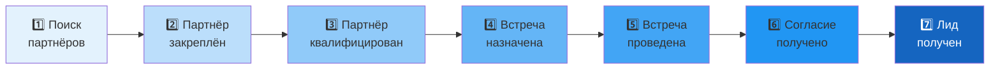
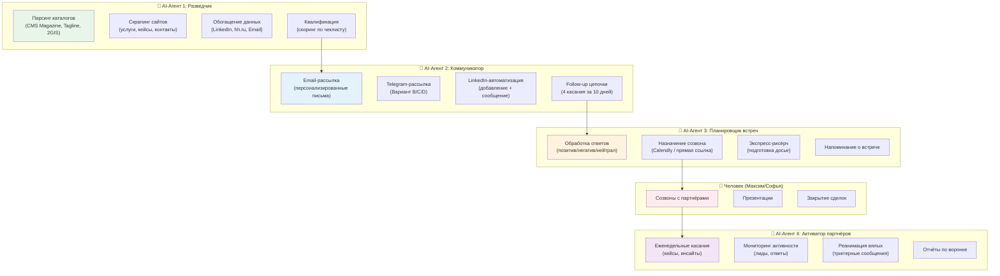

# 🎯 Стратегия партнёрского маркетинга B2B — Студия Trofimov

## Контекст и цель

**Компания:** Студия интеграции Trofimov — внедрение CRM/ERP (amoCRM, Bitrix24, RetailCRM, Мегаплан, МойСклад, 1С, YClients).  
**Услуги:** Консалтинг → Внедрение → Обучение → Техподдержка.  
**Опыт:** 7+ лет, своя команда аналитиков и разработчиков.

**Цель стратегии:** Построить системный канал привлечения клиентов через партнёров, который могут выполнять AI-агенты: поиск, первый контакт, вывод на созвон, поддержание активности.

---

## User Review Required

> [!IMPORTANT]
> **Требуется подтверждение по следующим вопросам:**
> 1. Есть ли доступ к ActiveCampaign и Telegram Bot для автоматизации?
> 2. Какой CRM используется для ведения партнёрской воронки (Bitrix24 / amoCRM)?
> 3. Готовы ли вы выделить бюджет на парсеры (PhantomBuster, 2GIS API)?
> 4. Кто будет проводить созвоны — Максим лично или Софья (менеджер по партнёрам)?

---

## I. Анализ сегментов партнёров (по документам)

На основе документа «Стратегия по сегментам партнёров» и «Портрет ЦА» выделены **5 ключевых сегментов**, ранжированных по приоритету:

```mermaid
graph TD
    A["🔥 I. Агентства и сервисные компании<br/>Приоритет: ВЫСОКИЙ"] --> A1["Digital-агентства"]
    A --> A2["SMM-агентства"]
    A --> A3["PR-агентства"]
    A --> A4["Креативные студии"]
    A --> A5["Таргет и контекст"]
    A --> A6["Web-разработка"]
    A --> A7["Мобильные приложения"]
    
    B["🔥 II. Консалтинг и сопровождение<br/>Приоритет: ВЫСОКИЙ"] --> B1["Бизнес-консультанты"]
    B --> B2["Построение отделов продаж"]
    B --> B3["Финансовый консалтинг"]
    B --> B4["HR-консультанты"]
    B --> B5["Коучи по систематизации"]
    
    C["⚡ III. Бэк-офис<br/>Приоритет: СРЕДНИЙ"] --> C1["Бухгалтерские сервисы"]
    C --> C2["Аутсорсинг учёта"]
    C --> C3["Юридическое сопровождение"]
    C --> C4["Аутсорсинг продаж"]
    
    D["⚡ IV. Вендоры и интеграторы<br/>Приоритет: СРЕДНИЙ"] --> D1["BI / CDP / PL"]
    D --> D2["CMS и ERP"]
    D --> D3["Чат-боты / AI"]
    D --> D4["Маркетплейсы / POS"]
    D --> D5["Телефония / Чаты"]
    
    E["🎯 V. Стратегические партнёры<br/>Приоритет: ТОЧЕЧНЫЙ"] --> E1["Франчайзинговые сети"]
    E --> E2["Стартап-инкубаторы"]
    E --> E3["Школы маркетинга/продаж"]
    E --> E4["CRM-конкуренты без внедрения"]
```



### Целевой профиль партнёра (из документа «Портрет ЦА»)

| Метрика | Значение |
|---------|----------|
| Форма бизнеса | ООО, ИП, ПАО |
| Модель | Услуги, B2B |
| Оборот | от 20 млн ₽/год |
| Команда | от 3 человек |
| Проекты/продажи | от 3 в месяц |
| Типы партнёрства | Лидген, подряд, контент/реклама |
| Срок до первых лидов | 1 неделя — 1 месяц |

---

## II. Каналы поиска по сегментам и типам «теплоты»

### 🧊 Холодные партнёры — не ищут подрядчика по CRM

| Канал | Действия | AI-автоматизация |
|-------|----------|------------------|
| **Каталоги** (CMS Magazine, Tagline, Clutch, Рейтинг Рунета) | Парсинг агентств, сбор email/телефон | ✅ Парсер + AI-обогащение |
| **Яндекс.Карты / 2ГИС** | Поиск по ключам "digital-агентство", "реклама бизнесу" по регионам | ✅ API 2GIS + скрипт |
| **Google/Яндекс поиск** | Ключи: "контекстное продвижение", "SMM агентство [город]" | ✅ Скрапер SERP |
| **LinkedIn** | Поиск по должностям (CEO, CMO) в агентствах | ✅ PhantomBuster |
| **Telegram** | Поиск каналов агентств, комментарии | ⚠️ Полуавтомат |

### 🌤️ Тёплые партнёры — осознают потребность, но не ищут активно

| Канал | Действия | AI-автоматизация |
|-------|----------|------------------|
| **vc.ru** | Публикация кейсов, комментинг в профильных лентах | ✅ Автопостинг + мониторинг |
| **Telegram-каналы** (Маркетинг без воды, Saleshub, Биржа digital) | Отклик на посты, мониторинг запросов | ✅ Telegram Bot API |
| **YouTube** | Экспертный контент, вебинары | ⚠️ Ручной запуск |
| **TargetHunter / Церебро / ВК** | Поиск в пабликах для агентств | ✅ API парсеров |
| **Маркетинговые форумы и конференции** | Спикерство, нетворкинг | ❌ Ручной |

### 🔥 Горячие партнёры — прямо сейчас ищут CRM-подрядчика

| Канал | Действия | AI-автоматизация |
|-------|----------|------------------|
| **Telegram** ("Ищу подрядчика", "Биржа digital") | Мониторинг ключевых слов, быстрый отклик | ✅ Telegram бот-мониторинг |
| **vc.ru / Хабр** | Поиск постов "ищем CRM-подрядчика" | ✅ RSS-мониторинг |
| **Kwork / FL.ru / Freelance Group VK** | Мониторинг заказов по CRM | ✅ Скрапер |
| **hh.ru** | Вакансии "CRM-менеджер", "Bitrix-интегратор" — признак потребности | ✅ API hh.ru |
| **Поисковые запросы** | "Нужен партнёр по автоматизации", "CRM для клиентов агентства" | ✅ Контекстная реклама |

---

## III. Стратегия взаимодействия: от выхода на ЛПР до закрытия

### 7-этапная воронка партнёрского маркетинга



---

### Этап 1 → 2: Выход на ЛПР (4-канальный фоллоу-ап)

> [!TIP]
> Ключевой принцип: **4 касания за 10 дней через разные каналы**

| День | Канал | Содержание |
|------|-------|-----------|
| **1** | Email | Персонализированное письмо с ценностью для бизнеса партнёра |
| **2** | Telegram | Краткий неформальный заход: «Писал на почту — зацепил ваш кейс по [нише]…» |
| **4** | LinkedIn | Добавление + комментарий под постом / InMail |
| **5–7** | Повторное email | Follow-up с PDF-кейсом или другим заходом |
| **10** | Звонок / голосовое | Персонализация + эмоциональный триггер |

**Мини-питч для каждого касания (2–3 строки):**

> «Смотрел ваши проекты в [нише]. Есть идея по доп. прибыли: мы забираем на себя CRM-внедрение для ваших клиентов, вы получаете доход без ручного труда. Пример — [кейс]. 10 мин созвона достаточно, чтобы понять, подходит ли это вам.»

**Обходной заход (если ЛПР недоступен):**
- «Кто в вашей команде занимается партнёрскими интеграциями? Не хочу отвлекать не по делу :)»
- «Может, есть человек из команды, кому это актуально?»

---

### Скрипты продаж: A/B-тестирование первых сообщений

На основе документа «АВ-тест сообщений» — **5 вариантов**, готовых к тестированию:

#### Вариант A — «Контроль + явные боли» *(базовый)*

> Добрый день! Меня зовут Максим, я руководитель студии интеграции Trofimov.
> 
> Мы внедряем и сопровождаем CRM/ERP, интегрируем с телефонией, мессенджерами, сайтами.
> 
> За счёт CRM помогаем вашим клиентам:
> • дольше оставаться с вами (рост LTV),
> • покупать больше и чаще (рост среднего чека),
> • а вам — не мучиться с поиском надёжного подрядчика по CRM.
> 
> Передадим вам лиды, когда на наших проектах возникает потребность по вашему направлению.
> 
> Если тема актуальна — расскажу подробнее и покажу пару кейсов.

#### Вариант B — «Угол: LTV и средний чек» *(для маркетинговых агентств)*

> Вы помогаете клиентам привлекать лиды, мы — **максимизировать выручку с этих лидов** через CRM/ERP.
> 
> А вам — надёжного подрядчика по CRM/ERP, которого не страшно рекомендовать.
> 
> Могу прислать 1–2 кейса по похожим нишам. Подойдёт такой формат?

#### Вариант C — «Боль с подрядчиками» *(для тех, кто обжёгся)*

> Часто слышу от агентств: «Клиент спрашивает, кого посоветовать по CRM, а надёжного подрядчика нет — страшно за свою репутацию».
> 
> Мы как раз закрываем эту задачу. Готовы быть вашим постоянным подрядчиком.
> 
> Насколько у вас сейчас закрыт вопрос с подрядчиками по CRM по шкале от 1 до 10?

#### Вариант D — «Короткий и прямой» *(холодный трафик)*

> Мы помогаем агентствам усиливать результаты клиентов за счёт автоматизации: CRM/ERP, интеграции.
> 
> У клиентов растут LTV и средний чек, а у вас появляется надёжный подрядчик.
> 
> Интересно ли вам в принципе иметь такого партнёра «под ключ»?

#### Вариант E — «Аналитика и цифры» *(для data-driven компаний)*

> Мы берём на себя **автоматизацию и аналитику** для ваших клиентов: CRM/ERP, телефония, мессенджеры.
> 
> Задачи: прозрачно считаем LTV и средний чек, выстраиваем допродажи, снимаем головную боль по подрядчику.
> 
> Написать детали здесь или удобнее созвониться?

> [!IMPORTANT]
> **Правило A/B-теста:** Тестировать по 1 переменной за раз. Минимум 50 отправок на вариант. Метрика: % ответов → % выхода на встречу.

---

### Ценностное предложение по направлениям

#### Для маркетинговых/SMM агентств:
> «Вы приводите заявки, а дальше бизнес всё теряет без CRM. Мы внедряем систему, и клиент доволен — а вы зарабатываете на доп. услуге.»

#### Для консалтинга:
> «Вы выявляете слабые места, а мы — внедряем рабочую систему. Клиент доволен, вы усиливаете доверие и зарабатываете %.»

#### Для HR:
> «Вашим клиентам нужна автоматизация подбора/адаптации — мы делаем это на базе CRM. Вы закрываете больше задач, мы платим вам процент.»

#### Для бухгалтерских сервисов:
> «Контроль дебиторки, платежей, напоминания клиентам — всё это через CRM. Ваш клиент получает порядок, вы — комиссию.»

---

### Партнёрская программа — условия

| Формат | Описание | Комиссия |
|--------|----------|----------|
| **Лидген** | Партнёр передаёт тёплого клиента | 10% (до 2 продаж) → 15% (от 3 продаж) |
| **White Label** | Работа под брендом партнёра | Индивидуально |
| **Маркетинговая коллаборация** | Совместные статьи, вебинары, кейсы | Взаимный обмен |
| **Бартер** | Услуги в обмен на рекомендации | Бесплатный аудит CRM |
| **Лицензии** | Продажа лицензий amoCRM/Bitrix24 | 20% от стоимости лицензий |

**Пример дохода партнёра (кейс Arto Marketing за 6 мес.):**
- Комиссия за услуги: 1 740 000 × 15% = **261 000 ₽**
- Комиссия за лицензии: 1 611 000 × 20% = **322 200 ₽**
- **Итого: 583 200 ₽ за 6 месяцев**

---

### Этап 4: Подготовка к встрече

**Мини-анкета перед созвоном (задать в переписке/Telegram):**
1. Кто ваша основная ЦА? (B2B или B2C?)
2. Часто ли клиенты возвращаются с задачами по автоматизации?
3. Какой формат партнёрства комфортнее: % от сделки, white-label, совместный продукт?

**Экспресс-рисёрч (5 мин):**
- Сайт: какие ниши, услуги, кейсы?
- Соцсети: какие боли озвучены?
- hh.ru: ищут ли CRM-менеджера, продажников?

---

### Этап 5: Структура встречи (10 этапов из документа)

1. **Приветствие** — обращение по имени
2. **Представление** — кто, откуда, уточнение ЛПР
3. **План встречи** — проговорить повестку
4. **Презентация Trofimov** — услуги, подход, преимущества
5. **Квалификация партнёра** — таблица вопросов (чем занимаются, средний чек, цикл сделки, объём)
6. **Партнёрская программа** — 3 формата + бонусы + лид-магнит
7. **Точки соприкосновения** — конкретные шаги, общая группа в Telegram
8. **Закрытие договорённостей** — итоги
9. **Шаги и сроки** — когда стартуем
10. **Follow-up** — отправка резюме встречи в чат в течение 24 ч

---

### Этап 5→6: Follow-up после встречи

**Шаблон резюме встречи (из документа «Follow up»):**

> Коллеги, добрый день! Создала чат для нашего партнёрского взаимодействия.
> 
> **Резюме встречи:**
> 1. Тема: Встреча с партнёром
> 2. Дата проведения: [дата]
> 3. Участники: [список]
> 4. Обсудили варианты взаимодействия. Мы готовы брать клиентов на настройку CRM.
> 5. Предлагаем бесплатный аудит для знакомства.
> 
> **Варианты сотрудничества:**
> 1) Лидген
> 2) White label
> 
> **Бонусы:** 10-15% от услуг, 20% от лицензий.

**Микрошаг после встречи** (не «передавайте лиды», а простой шаг):
- «Прислать 1–2 примера клиентов, с которыми можно попробовать»
- «Посмотреть наш партнёрский гайд и дать обратную связь»
- «Протестировать один мини-проект на white-label»

---

### Отработка возражений

| Тип возражения | Реакция |
|---------------|---------|
| **«Нам неинтересно»** | «Если клиент придёт с запросом на CRM — вы сами внедряете или ищете подрядчика?» → при отказе: «Зафиксирую. Если появится клиент с нуждой в CRM — я рядом, можно просто кинуть контакт.» |
| **«Уже есть подрядчик»** | «Отлично! Не предлагаю заменять — можем быть backup-интегратором, или закрывать то, что они не берут (retailCRM, YClients, сложная автоматизация).» |
| **«А зачем это нам?»** | «Один клиент = 10–20 тыс. ₽ для вас. Вы передаёте контакт, мы всё ведём. Давайте попробуем на одном?» |

---

## IV. Лид-магниты и инструменты прогрева

1. **Чек-лист «Нужна ли вашему бизнесу CRM?»** (17 вопросов) — готов, размещать на сайтах партнёров
2. **Бесплатный аудит CRM** — предлагать на встречах как якорь
3. **PDF «Как ваши клиенты теряют деньги без CRM»** — для email/Telegram рассылки
4. **Telegram-бот с чек-листом** — встроить в сайты партнёров
5. **Кейсы под сегменты** — SMM, HR, консалтинг, бухгалтерия (по 1–2 кейса)

---

## V. Архитектура AI-агентов для автоматизации

> [!IMPORTANT]
> Эта секция описывает, как разбить процесс на задачи для AI-агентов, чтобы они выполняли рутину, а человек подключался только к созвонам и сложным переговорам.

### Общая архитектура



---

### AI-Агент 1: «Разведчик» — поиск партнёров

| Задача | Инструменты | Частота |
|--------|------------|---------|
| Парсинг каталогов агентств | Python-скрипт + Scrapy | 1 раз/нед |
| Сбор email/phone с сайтов | Hunter.io API / Snov.io | При добавлении |
| Поиск по 2ГИС/Яндекс.Картам | API 2GIS | 1 раз/мес по регионам |
| LinkedIn-профили ЛПР | PhantomBuster | 1 раз/нед |
| Скоринг: оборот, команда, услуги | Чеклист из «Портрет ЦА» | Автоматически |
| Мониторинг Telegram-каналов | Telegram Bot API + ключевые слова | Постоянно |
| Мониторинг hh.ru (вакансии CRM) | API hh.ru | Ежедневно |

**Триггеры для приоритизации:**
- ✅ В портфолио есть проекты с CRM
- ✅ Упоминают «автоматизацию» / «цифровизацию» в блоге
- ✅ Открытые вакансии Sales / CRM менеджеров
- ✅ УТП типа «приводим заявки, но дальше — ваш отдел продаж»

### Масштабирование Агента-Разведчика (План парсинга площадок)

На базе успешного парсинга CMS Magazine, архитектура разведчика масштабируется на 5 ключевых площадок:

#### 1. Биржи фриланса (kwork.ru / freelance.ru)
- **Целевая аудитория:** Digital-команды среднего/малого размера, фриланс-интеграторы.
- **Алгоритм:** 
  - Парсинг каталога услуг (Кворки "Настройка Яндекс Директ", "SMM ведение", "Консалтинг").
  - Сбор контактов команд-синьоров для White Label партнёрства.
  - *Технический обход:* Headless Playwright с ротацией IP и эмуляцией человеческого скроллинга.

#### 2. Медиа-платформы (vc.ru / Habr)
- **Целевая аудитория:** Экспертные B2B-компании, системные интеграторы.
- **Алгоритм:** 
  - Парсинг авторов в хабах "Маркетинг", "Управление проектами", "Менеджмент".
  - Сбор контактов ЛПР и ссылок на корпоративные сайты.
  - Поиск запросов в комментариях.
  - *Технический обход:* Скрапинг API платформ (где возможно) или RSS-лент блогов компаний.

#### 3. Классический SERP (Яндекс-браузер / Поисковики)
- **Целевая аудитория:** Агентства, которые не представлены на биржах и в каталогах, но имеют сильное SEO.
- **Алгоритм:**
  - Парсинг выдачи Яндекса по запросам: "Заказать SMM Москва агентство", "Внедрение 1С подрядчик".
  - Скрапинг сайтов (сбор Email, телефона и ссылок на соцсети).
  - Эвристика на базе DuckDuckGo / Яндекса для извлечения ЛПР и ОКВЭД (пробив через Rusprofile). 
  - *Технический обход:* Внедрение `playwright-stealth` и агрессивная рандомизация запросов для защиты от CAPTCHA.

Все собранные данные с площадок унифицируются под стандартные 17 параметров (ФИО ЛПР, Оборот, Клиенты, и т.д.) и сохраняются в `Горячие_Партнеры_База.xlsx`.

### Модуль Универсального Обогащения Данных (Enrichment Engine)

Текущая логика обогащения (поиск ЛПР и Оборота через Rusprofile) выносится из разрозненных скриптов в единый централизованный модуль `enrichment.py`. Этот движок будет пропускать через себя **каждого** лида, найденного в *любом* канале (CMS, Kwork, Freelance, HH, Yandex, Habr), и делать следующее:

1. **Юридический скан (Rusprofile Heuristics):** Поиск ФИО директора (ЛПР), ОКВЭД и Выручки через прокси-запросы к поисковикам.
2. **Анализ корпоративного сайта:**
   - Парсинг `<title>`, `<meta description>`, и текстовых блоков (`<h1>`, `<h2>`) с сайта партнера.
   - Эвристическое извлечение "Основного продукта" (например, есть ли упоминания "интеграция AmoCRM", "разработка на Битрикс", "SMM").
   - Сбор "Клиентов" (поиск блоков `<div class="clients">`, `<section id="portfolio">` и логотипов).
3. **Глубокий поиск контактов:** Сканирование страниц `/contacts` или `/about` для извлечения Telegram, WhatsApp, Email, и добавочных телефонов.

**План рефакторинга:**
1. Создать `enricher.py` с универсальными функциями `scan_rusprofile()` и `analyze_company_website()`.
2. Подключить модуль как middleware перед вызовом `add_lead_to_excel(...)` во всех созданных скриптах (`scout_hh.py`, `scout_yandex.py` и т.д.).
3. Применить обновленный алгоритм к парсерам.

---

### AI-Агент 2: «Коммуникатор» — первый контакт и follow-up

**Интеграции:** ActiveCampaign (CRM + email-автоматизация) + Telegram Bot API

#### ActiveCampaign-воронка:

1. **Создание контакта** → `ACTIVE_CAMPAIGN_CREATE_CONTACT` (email, имя, компания, теги: сегмент, город, теплота)
2. **Тег сегмента** → `ACTIVE_CAMPAIGN_MANAGE_CONTACT_TAG` (digital-agency, smm, consulting, hr, backoffice)
3. **Подписка на список** → `ACTIVE_CAMPAIGN_MANAGE_LIST_SUBSCRIPTION` (partners-cold, partners-warm, partners-hot)
4. **Запуск автоматизации** → `ACTIVE_CAMPAIGN_ADD_CONTACT_TO_AUTOMATION`
   - Automation 1: «Холодный 4-канальный фоллоу-ап» (Email → Telegram → LinkedIn → Follow-up)
   - Automation 2: «Тёплый прогрев» (кейсы раз в 2 недели)
   - Automation 3: «Реанимация» (через 30 дней без ответа)

#### Telegram-коммуникация:

- `TELEGRAM_SEND_MESSAGE` — первое касание (Вариант B/C/D из A/B-теста)
- `TELEGRAM_SEND_DOCUMENT` — PDF-кейс, чеклист
- `TELEGRAM_GET_UPDATES` — мониторинг ответов
- `TELEGRAM_GET_CHAT_HISTORY` — контекст переписки

#### Цепочка касаний (автоматизация):

```
День 1  → Email (Вариант A/B) + тег "first_touch"
День 2  → Telegram (короткий заход) + тег "telegram_sent"  
День 4  → LinkedIn (запрос + InMail)
День 7  → Email follow-up с PDF-кейсом + тег "followup_1"
День 10 → Голосовое / звонок (вручную или через бот)
День 14 → Если нет ответа → тег "cold_nurture" → автоматизация прогрева
```

---

### AI-Агент 3: «Планировщик встреч» — вывод на созвон

| Триггер | Действие |
|---------|----------|
| Ответ «интересно» / «расскажите подробнее» | Предложить 2-3 слота для созвона → Calendly-ссылка |
| Ответ «пришлите кейсы» | Отправить PDF-кейс + через 2 дня предложить созвон |
| Ответ «сейчас не актуально» | Тег «warm_nurture» → прогрев каждые 2 недели |
| Ответ «уже есть подрядчик» | Тег «has_vendor» → отработка возражения + backup-предложение |
| Нет ответа 14 дней | Тег «cold_nurture» → мягкие касания раз в месяц |

**Подготовка досье к встрече (автоматическая):**
1. Скрапинг сайта партнёра → ниши, услуги, кейсы
2. LinkedIn-профиль ЛПР → опыт, должность
3. hh.ru → открытые вакансии
4. Формирование 3 гипотез (из документа «Этапы воронки»)

---

### AI-Агент 4: «Активатор» — поддержание активности существующих партнёров

| Действие | Частота | Канал |
|----------|---------|-------|
| Отправка нового кейса | 1 раз/2 недели | Email + Telegram |
| «У нас освободился слот — если есть клиент, зови!» | 1 раз/2 недели | Telegram |
| Напоминание о бесплатном аудите для их клиента | 1 раз/месяц | Email |
| Отчёт по партнёрской комиссии | 1 раз/месяц | Email |
| Реанимация «вялых» партнёров (>30 дней без активности) | По триггеру | Telegram + Email |
| Приглашение на вебинар / совместный контент | По событию | Все каналы |

**Триггер реанимации (из документа «Этапы воронки»):**
> «У нас сейчас зашёл клиент с ecom-бизнесом — подумала, что у вас такие тоже бывают. Если что — можно его обсудить вместе, и заодно запустить пилот :)»

---

## VI. Метрики и KPI

| Метрика | Цель/месяц |
|---------|-----------|
| Найдено новых потенциальных партнёров | 200+ |
| Первых касаний отправлено | 150+ |
| Получено ответов (Response Rate) | 15-25% |
| Назначено встреч | 10-15 |
| Проведено встреч | 8-12 |
| Получено согласие на партнёрство | 3-5 |
| Получено первых лидов от партнёров | 2-3 |
| Средняя комиссия партнёра за лид | 15 000-50 000 ₽ |

---

## VII. Технический стек для реализации

| Компонент | Инструмент | Роль |
|-----------|-----------|------|
| **CRM** | Bitrix24 / amoCRM | Воронка партнёров |
| **Email-автоматизация** | ActiveCampaign | Рассылки, автоматизации, теги |
| **Telegram** | Telegram Bot API | Рассылка, мониторинг, чат-боты |
| **LinkedIn** | PhantomBuster | Парсинг, автодобавление |
| **Парсинг** | Python + Scrapy | Сбор данных из каталогов |
| **Обогащение** | Hunter.io / Snov.io | Email/phone поиск |
| **Встречи** | Calendly / TidyCal | Автоматическое планирование |
| **Аналитика** | Google Sheets / Metabase | Отчёты по воронке |

---

## Open Questions

> [!WARNING]
> **Вопросы, требующие вашего решения:**
> 1. Какие именно Telegram-каналы уже мониторятся? Нужно составить список.
> 2. Есть ли бюджет на PhantomBuster (~$60/мес) и Hunter.io (~$50/мес)?
> 3. Хотите ли вы, чтобы я создал конкретные скиллы (AI-навыки) для каждого агента?
> 4. Нужно ли разработать конкретный Python-скрипт для парсинга каталогов?
> 5. Стоит ли создать Telegram-бота для автоматического мониторинга запросов?

## Verification Plan

### Автоматизированная проверка
- Тестовый запуск цепочки касаний на 10 контактах через ActiveCampaign
- Тестовая рассылка через Telegram Bot API
- Проверка парсера на 1 каталоге (CMS Magazine)

### Ручная проверка
- Проведение 3 пилотных встреч по новой структуре
- A/B-тест сообщений: 50 отправок на вариант A vs B
- Замер Response Rate через 2 недели
